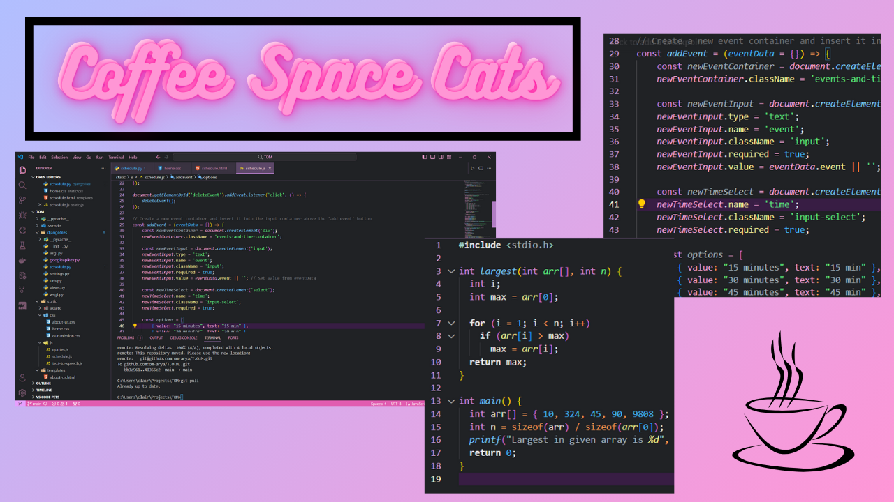
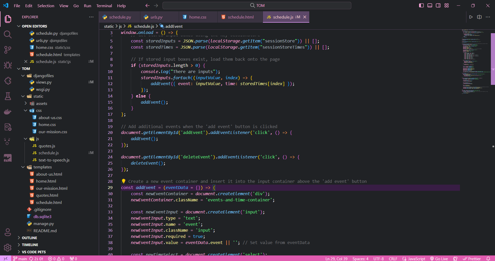

# Coffee Space Cats
<h3 align="center">☕ Coffee Space Cats decorates your VS Code IDE with a cool, modern design. 😺</h3>

  

<h3 align="center">🚀 Enter your coding space with the company of coffee cats! 🌟</h3>

  
  

## Install
1. Go to [VS Marketplace](https://marketplace.visualstudio.com/items?itemName=CatsCoffee.claire)
2. Click on the "Install" button
3. Enter `Ctrl+Shift+P` (Windows) or `Cmd+Shift+P` (Mac) in VS Code
4. Search for "Preferences: Color Theme" in the Command Palette
5. Click and find the "Coffee Space Cats" theme
6. Happy Hacking! 🎉
