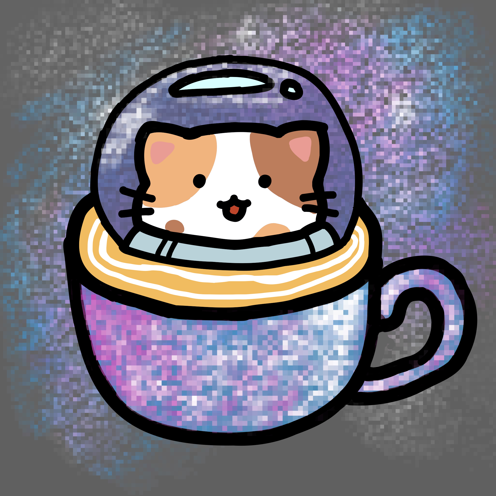
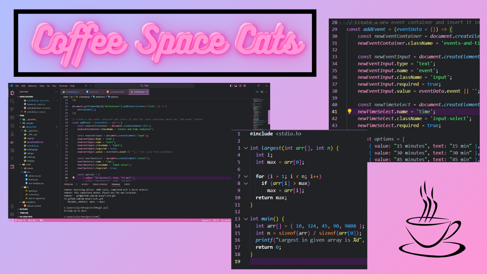
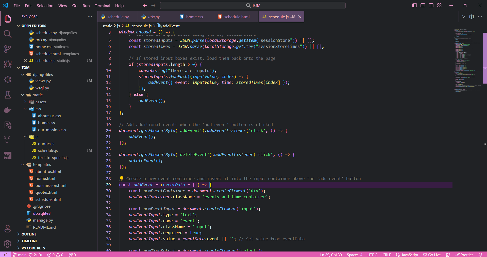
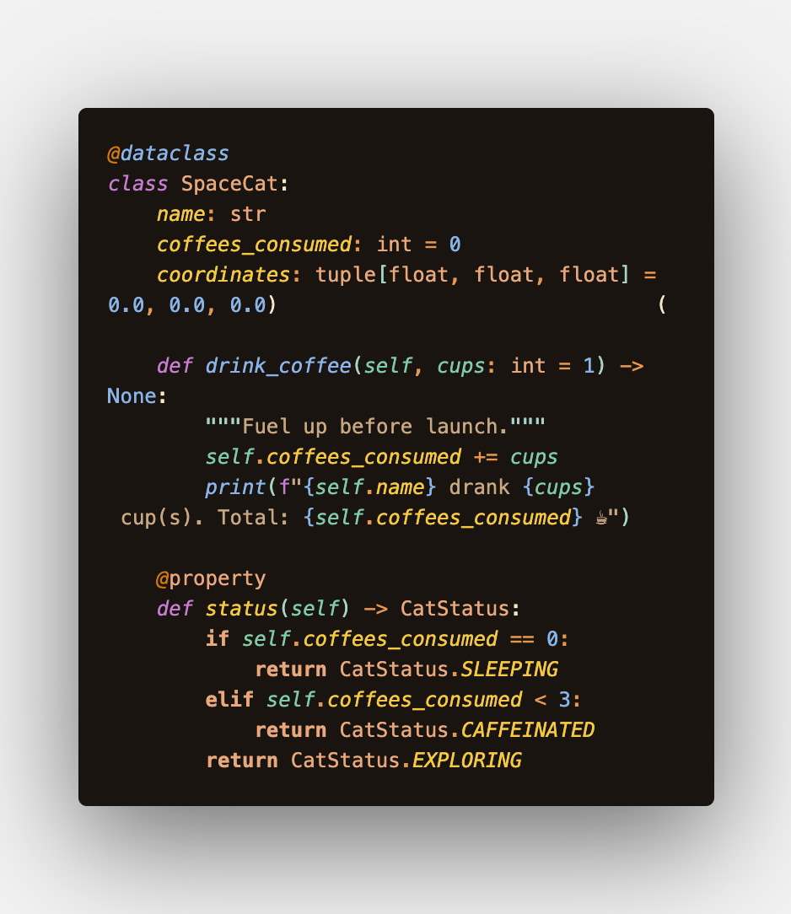
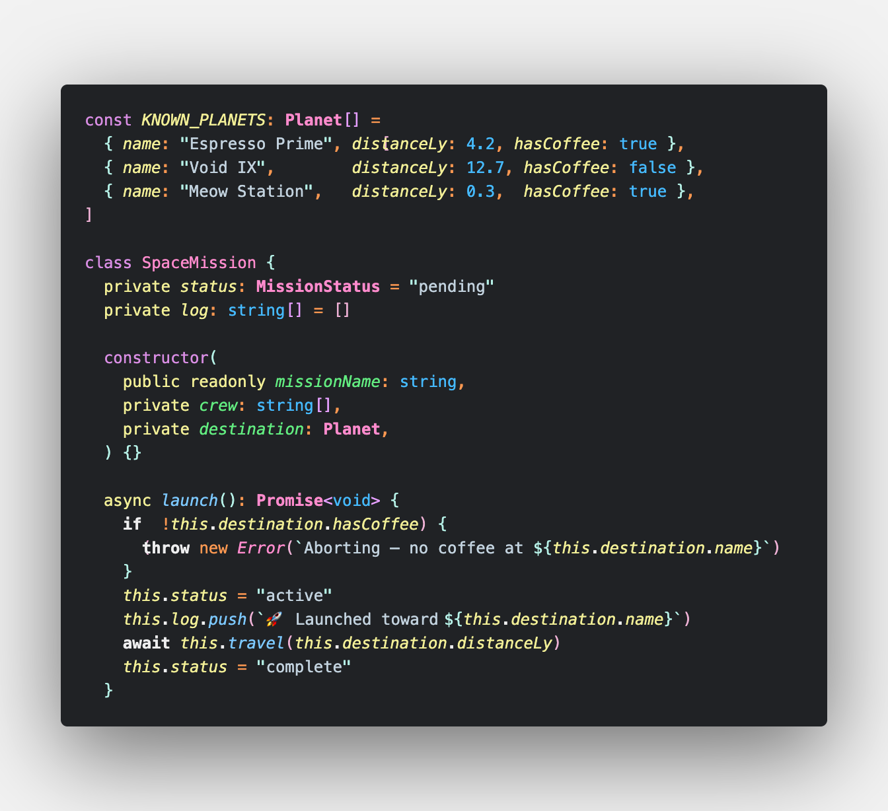
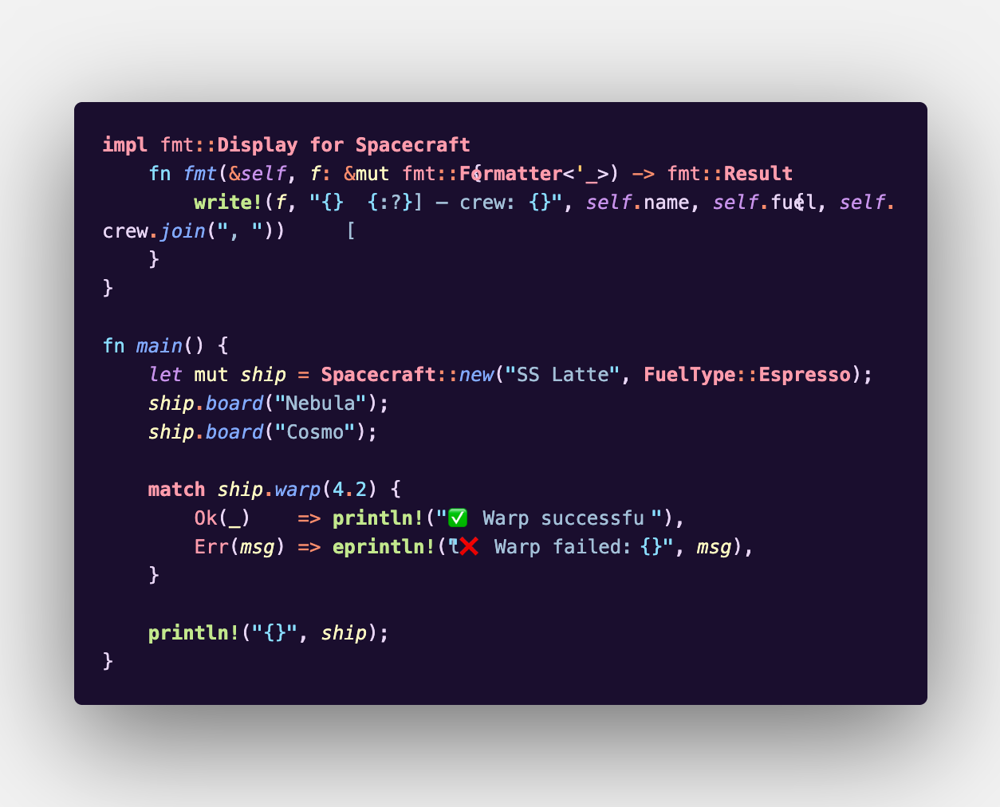
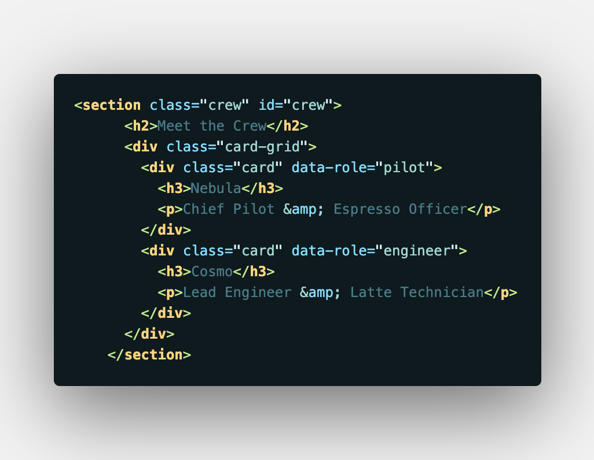
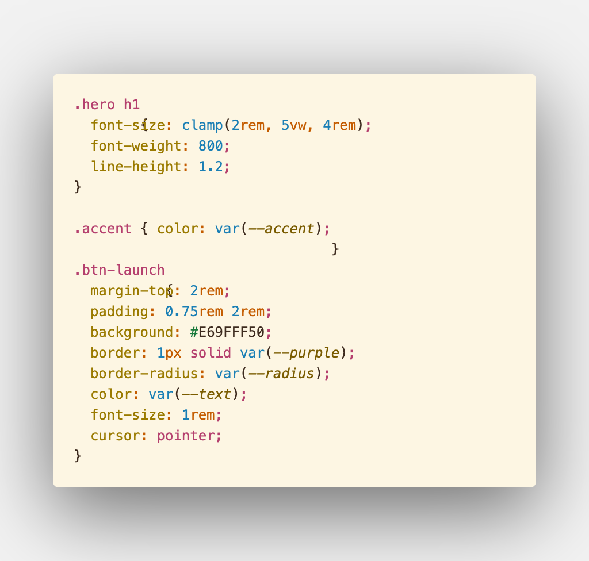

# Coffee Space Cats
<h3 align="center">☕ Coffee Space Cats decorates your VS Code IDE with a cool, modern design. 😺</h3>

<p align="center">
  
</p>

<h3 align="center">🚀 Enter your coding space with the company of coffee cats! 🌟</h3>

<p align="center">
  
  
</p>

## Variants

| Theme | Style | Aesthetic |
|---|---|---|
| **Coffee Space Cats** | Dark | Classic space — pink, purple, cyan neon on deep grey |
| **Dawn** | Light | Warm cream — deep rose, purple, and blue on cream |
| **Cosmic Latte** | Dark | Espresso tones — peach, gold, and mint on dark brown |
| **Nebula** | Dark | Deep purple space — soft pink, periwinkle, and pale green |
| **Midnight** | Dark | Near-black minimal neon — same accents, maximum darkness |
| **Aurora** | Dark | Northern lights — seafoam, sky blue, amber on dark teal |

Switch between them via `Cmd+Shift+P` → **Preferences: Color Theme**.

## Screenshots

<p align="center">
  
  
  
</p>
<p align="center">
  
  
</p>

## Features

- 6 theme variants — 5 dark, 1 light
- Neon pink, purple, and cyan accent palette
- Full syntax highlighting for JavaScript, TypeScript, Python, HTML, CSS/SCSS, JSON, Markdown, Rust, Go, Java, Ruby, C/C++, Swift, YAML, SQL, and Bash
- Matching file icon theme with 29 file type icons and 14 folder icons
- Bracket pair colorization using the theme palette
- Jupyter notebook UI colors
- Semantic highlighting enabled
- Styled terminal, status bar, activity bar, tabs, and git decorations

## Install

1. Go to [VS Marketplace](https://marketplace.visualstudio.com/items?itemName=CatsCoffee.CoffeeSpaceCats)
2. Click the **Install** button
3. Open the Command Palette: `Ctrl+Shift+P` (Windows) or `Cmd+Shift+P` (Mac)
4. Search for **Preferences: Color Theme** and select your variant
5. Optionally, search for **Preferences: File Icon Theme** → **Coffee Space Cats Icons**
6. Happy Coding! 🎉

## Customization

Override specific colors in your `settings.json`:
```json
"editor.tokenColorCustomizations": {
  "[Coffee Space Cats]": {
    "comments": "#999999"
  }
}
```
