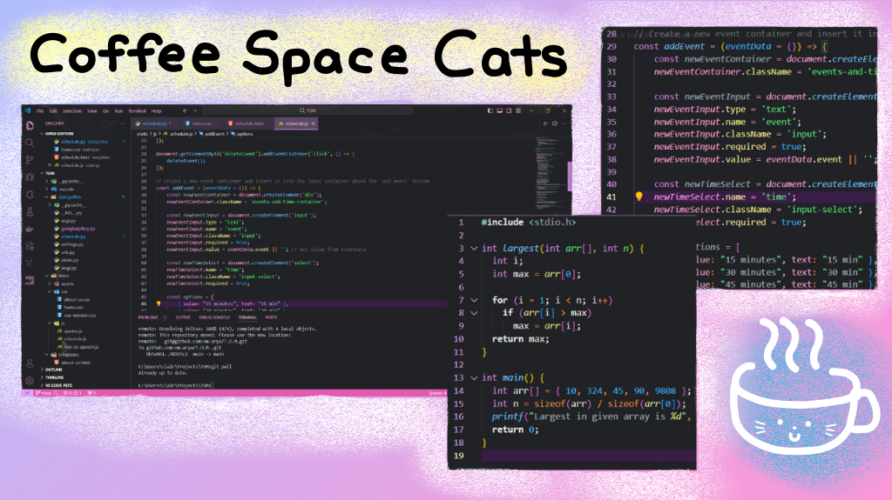

# Coffee Space Cats

☕ Coffee Space Cats decorates your Visual Studio Code IDE with a cool, modern design. 😺

## Install
1. Go to [VS Marketplace](https://marketplace.visualstudio.com/items?itemName=CatsCoffee.claire)
2. Click on the "Install" button
3. Enter `Ctrl+Shift+P` (Windows) or `Cmd+Shift+P` (Mac) in VS Code
4. Search for "Preferences: Color Theme" in the Command Palette
5. Click and find the "Coffee Space Cats" theme
6. Happy Hacking! 🎉
